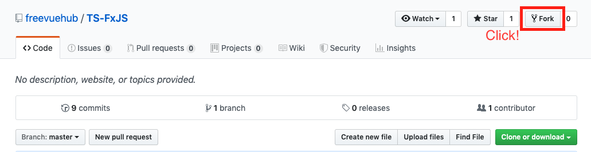
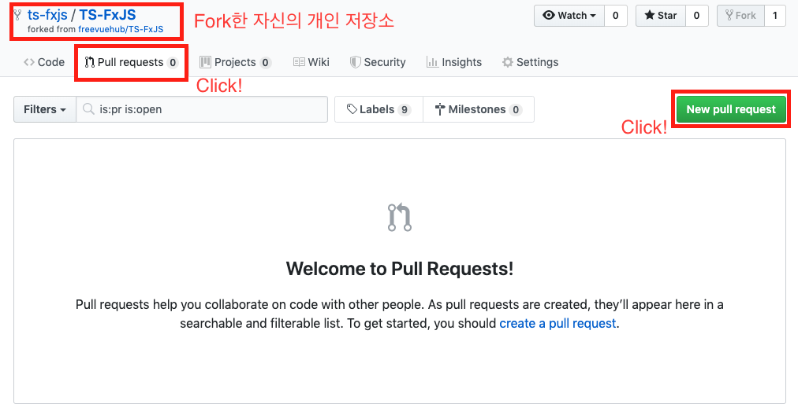
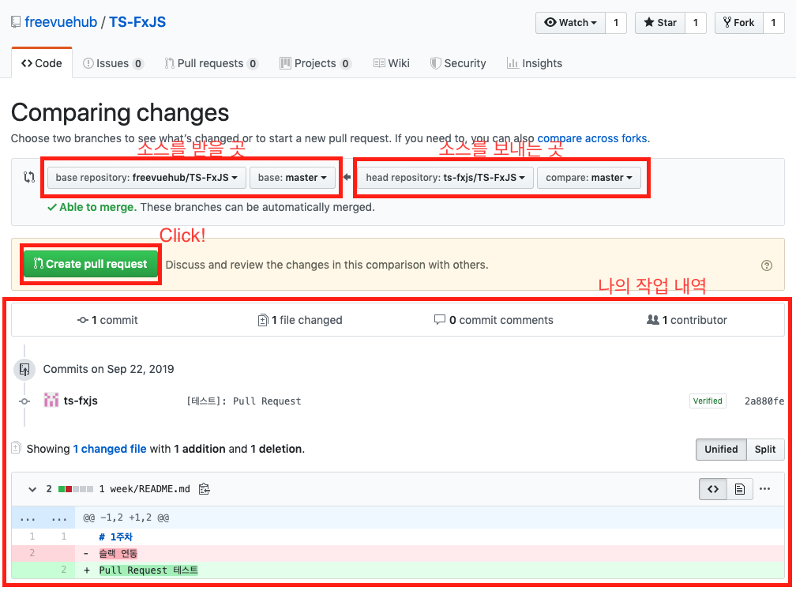

# Typescript + FxJS of marpple

> Typescript와 함수형 오픈소스인 FxJS를 이용한 스터디 그룹입니다.

## 시작하기 전
> * 해당 스터디는 모집이 마감되었습니다.
> * 해당 스터디는 Github를 사용할 예정이며 소스들이 오픈됩니다.
> * ES6 이상으로 사용할 예정이며 해당 버젼의 문법에 대한 지식이 필요합니다.
> * 후에 추가되는 내용은 해당 Git 저장소에 공유됩니다.
> * 오픈 채팅방 코드는 스터디 문의 후 알려드립니다.

## 스터디 정보
> ### 인원
> 5명
> ### 내용
> Typescript의 함수형 프로그래밍
> ### 세부 내용
> * 함수형 오픈 소스인 FxJS의 소스들을 Typescript로 바꾸어 보는 시간입니다.
> * 매주 선정되는 소스들을 Typescript로 바꾸어 본 후 Git으로 공유하여 소스리뷰를 진행하는 방식입니다.
> ### 스터디 방식
> 온라인, 오프라인 (희망자에 한하여 오프라인 진행)
> ### 스터디 기간
> 더 이상 리펙토링할 소스가 없을 경우 종료
> ### 시작일
> 10월 5일
> ### 종료일
> 미정
> ### 온라인 진행방식
> 행아웃 (더 좋은 프로그램이 있으면 해당 바뀔 예정)
> ### 오프라인 진행방식
> 희망자에 한하여 지역을 정하여 진행

## 스터디 진행
> 1. [스터디 저장소](https://github.com/StudyFxGroup/FxTS)를 Fork한다. 
> 2. Fork한 개인 저장소로 스터디를 시작한다.
>     * 각 week폴더에 자신의 닉네임으로 폴더를 생성한다.
>     * 해당 폴더에서 개발을 하고 commit push를 한다.
>     * 다른 스터디원의 소스를 분석할 수 있으나 수정은 지양한다.
> 3. 완료된 소스를 스터디 저장소로 옮기기 위하여 Pull Request을 요청합니다. 
> 4. 설정을 하고 스터디 저장소로 Pull Request한다. 
> 5. 다른 스터디원들과 소스리뷰를 진행한다.
> 6. 기준 레포에서 문제를 받아오려면 위의 Pull Request 요청을 반대로 진행하시면 됩니다.

## 사용할 언어
> * Javascript (ECMAScript)
> * Typescript

## 문의
> * 카카오톡: https://open.kakao.com/me/freevue

## 참고

> * 스터디 오픈 채팅방: https://open.kakao.com/o/gFeBQ8Eb
> * FsJS: https://github.com/marpple/FxJS

